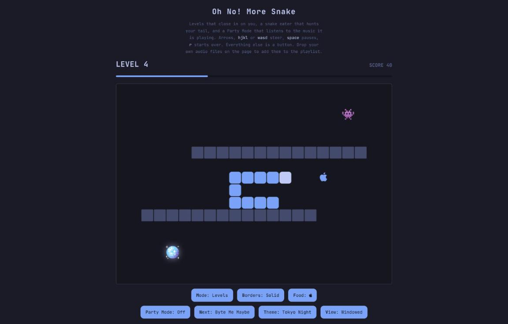

# Oh No! More Snake

Omasnake, in a browser. Levels with closing obstacle layouts, a snake eater
that hunts your tail, and a Party Mode that analyses the music it is playing
and paints the board with it.

Play it at **[oh-no-more-snake.com](https://oh-no-more-snake.com)**.

This is a port of [omasnake](https://github.com/jhgundersen/omasnake), the
standalone Qt 6 game for Omarchy — same rules, same numbers, same jokes, no
Qt. It is framework-free HTML, Canvas and JavaScript, deployed on Cloudflare
Workers alongside
[Oh No! More Agents](https://github.com/jhgundersen/oh-no-more-agents).



## Play

```sh
npm install
npm run db:local  # once, to create the local charts database
npm run dev       # Wrangler prints the URL, normally http://localhost:8787
```

`npm run serve` is a dependency-free alternative that serves `public/` with
Python, but it has no Worker, so the charts will not answer. The game is ES
modules either way, so it needs to be served — opening `public/index.html` from
the filesystem will not work.

## Controls

- Arrow keys, `hjkl`, or `wasd` — steer
- Space — pause, resume, or restart
- `p` — toggle Party Mode
- `n` — switch to the next soundtrack
- `m` — switch between Levels and Endless
- `b` — switch between wrapping and solid borders
- `f` — cycle the food skin
- `r` — start a fresh run
- `t` — cycle the theme
- `v` — fullscreen
- `c` — charts
- `g` — jump to the next boss level, on localhost or with `?debug`. A run that
  used it is never charted and never sets a best score.
- Escape — leave fullscreen, or pause

On a touchscreen, drag on the board to steer and tap it to cycle the food skin.

`?full` opens the page with the board covering the viewport and nothing else on
screen — for kiosks, second monitors and screenshots. It is the CSS half of
fullscreen rather than the Fullscreen API, which refuses any request that did
not come from a gesture and so can never be driven from a URL. `?full=0` is an
explicit no, so the parameter can be templated in as a variable.

## How it plays

Levels introduces one of eight repeating obstacle layouts after level 1, then a
boss fight, then the eight again — narrower, faster and worth more each time
round. Every set the gaps close by one cell, the level costs one more apple,
and the tick gets 7 ms faster, down to a floor of 55 ms. From level 4, a snake eater hunts the tail: each bite removes one
block and one point, and steering the head into it earns two points and drives
it away for a while. Endless is the classic open board at one speed.

Borders wrap until you press `b`, which is the one rule here that differs from
the desktop version — a page somebody just opened is usually their first game.
Moving into the cell your own tail is leaving is legal, because the tail leaves
it during the same tick. In Party Mode that is worth a point.

Best scores, lifetime playtime, border mode, food skin and theme are stored in
the browser's local storage. Levels and Endless keep separate bests.

## Party Mode

Press `p`, or eat the disco ball that appears while the music is off.

Party Mode analyses each song live through Web Audio — one-pole filters split
it into three bands, a rolling energy average finds onsets, and a bank of
Goertzel resonators produces 48 logarithmic bands. No BPM file or other
metadata is required. The obstacles light up by band, the snake wears the lead
line, and a beat sends a wave down its body.

Scoring changes with it. Food starts at one point; eating another within two
seconds raises the next one to two, then three, up to ten. The streak meter
counts down and expiry resets food to one point. Every point scored also grows
the snake by one block, appearing over the following ticks. Corner Cutting,
Thread the Needle, Snake Byte, Tailgate, Beat Eater, Perfect Timing and Dance
Floor reward tight driving and moving in time with the music. Each announces
itself on the board.

More events unlock as Levels progresses. Beat Gates appear from level 6 and
open only on strong beats, starting with one gate and adding another every
three levels up to four. Reverse Venom appears from level 6 and rotates your
steering a quarter turn for five seconds. From level 8, Food Frenzy scatters
ten bonus foods for eight seconds. Timing and positions are randomised every
time.

With the music on, a cleared level waits for a beat before the next one fades
in — but not forever. A track too slow or too quiet to produce one gives up
after two and a half seconds, and after the first second any key or a tap
gets on with it.

## Your own music

Drop audio files anywhere on the page. They join the playlist, sorted by
filename, and `n` cycles through them. This is the browser's answer to the
desktop version's `~/.local/share/omasnake/music`; object URLs do not survive a
reload, so dropped tracks last for the session.

## Boss fights

Every ninth level is a duel. After all eight obstacle layouts have been seen
and before they start again — narrower, faster and worth more — a rival snake
turns up in an empty arena, announced by name and portrait the way Party Mode
announces itself.

Eat him. Every part of a boss is worth reaching: bite the tail and it gets
shorter, bite the middle and it comes apart, leaving a headless piece to drift
around the arena until you eat that too. Reach the head and the fight is over
on the spot — whatever was still attached to it sloughs off and the finish
begins.

It is hunting you the same way. It takes blocks off your tail one at a time,
and there is no floor to that: eaten down to your last block, or caught by the
head at any length, is a loss. There is no timer, so a duel can be taken
slowly — but not indefinitely.

When only its head is left, everything stops for **FINISH HIM!** and five
seconds to press one of these:

| | |
|---|---|
| `↑ ↑ ↓ ↓` | Kernel Panic |
| `← → ← →` | Merge Conflict |
| `↓ ↓ ↑ ↑` | Garbage Collected |
| `← ← → →` | Stack Unwound |
| `↑ ↓ ← →` | Force Pushed |

Each one has its own animation, and each one ends with the boss's head coming
apart: shattered with the screen in Kernel Panic, blown back off the far wall
in Force Pushed, carried up the pipe in Garbage Collected. There is a
considerable amount of blood, which for a game about a snake eating an Apple
logo felt like the right call.

Only the last four inputs count, so a fumbled start costs nothing. Hesitating
past five seconds is a finish too — a worse one, and it still ends the same way. Winning pays for the level it
cleared, and whatever was scored during the fight is kept on top.

The six bosses cycle: Null Pointer, Segfault, Deadlock, Stack Overflow, Race
Condition and Memory Leak. Their portraits are drawn rather than loaded, so
they cost nothing to download and sit correctly in every theme. You can tell
the two snakes apart at a glance without reading anything: yours has wide
friendly eyes, and a boss has narrow red ones under a scowl.

## Charts

Press `c`. The four boards are the highest scores of the last 24 hours, 7 days
and 30 days, and of all time — rolling windows, so no timezone has to be picked
and everybody reads them the same way.

There is nothing to type. A finished run is posted as a score, whether it was
Levels or Endless, whether Party Mode was on, and when it ended. No name, no
account, no cookie, nothing identifying. The level shown is derived from the
score by the server rather than accepted from the page.

Treat it as a community number rather than a leaderboard, but not a free-for-all.
A run asks the server for a signed token when it starts and hands it back with
the score, so both ends of the clock are the server's and the page never gets to
say how long its own run took. The score then has to be reachable in that time:
Endless is capped by the area of the board, because every point is a block the
snake grows by and nothing resets it; Levels has to account for the fade out and
back in that each level it claims would have cost. A token is spent when it is
used, so it buys exactly one entry. Submissions are also bounded, idempotent per
run, and rate-limited per minute against an address hashed with a Worker secret.

None of that makes a posted number true — the client is still the thing doing
the counting. It makes a made-up one cost the time it claims to have taken,
which for a game about a snake is the right amount of effort to demand.

## Themes

Ten palettes in the Omarchy house style, dark and light. The first load follows
`prefers-color-scheme`; after that `t` cycles and the choice is remembered.
Nothing in the game hardcodes a dark-only surface.

## Development

Requires Node.js 20 or newer for the tests; the game itself has no
dependencies and no build step.

```sh
npm run check     # syntax checks and the model tests
npm test          # the model tests alone
```

`test/game.test.js` is a port of the Qt version's `tests/tst_omasnake.cpp`,
extended where the browser port introduced its own risks. `public/snake/Game.js`
holds the rules and imports nothing from the browser, which is what lets Node
run them.

## Deployment

Production is <https://oh-no-more-snake.com>, with `www` served the same way.

```sh
npx wrangler login
npm run deploy
```

`wrangler.jsonc` deploys `public/` as static assets, attaches both custom
domains, and runs the Worker first for `/api/*` only. The charts live in D1.

Setting it up from scratch needs the database and the hashing salt:

```sh
npx wrangler d1 create oh-no-more-snake     # put the id in wrangler.jsonc
npx wrangler secret put RATE_LIMIT_SALT     # any long random string
npx wrangler secret put RUN_TOKEN_SECRET    # another one, used to sign runs
npm run db:remote
npm run deploy
```

For `npm run dev`, put the same two names in a `.dev.vars` file. It is
gitignored, and the values there only ever sign local runs.

### `POST /api/runs`

```json
{ "token": "eyJuIjoi….Ux7…" }
```

Taken when a run starts. It carries a nonce and the server's clock, signed;
nothing in it is readable or writable by the page.

### `GET /api/scores`

```json
{
  "periods": {
    "day": [{ "rank": 1, "score": 57, "level": 5, "mode": "levels", "party": true, "at": "2026-08-25 09:12:00" }],
    "week": [], "month": [], "all": []
  },
  "runs": 1,
  "size": 10
}
```

### `POST /api/scores`

```json
{
  "eventId": "550e8400-e29b-41d4-a716-446655440000",
  "score": 57,
  "mode": "levels",
  "party": true,
  "token": "eyJuIjoi….Ux7…"
}
```

The response is the updated boards. Reusing an `eventId` is idempotent, which
is what makes the browser's retry queue safe; reusing a `token` stores nothing,
because a run token buys one entry. A score that could not have been reached in
the time the token has been open comes back `422` with the reason.

## License

MIT. The game design, mechanics and copy are derived from the MIT-licensed
omasnake, itself derived from the MIT-licensed omarchy-snake-plugin.
